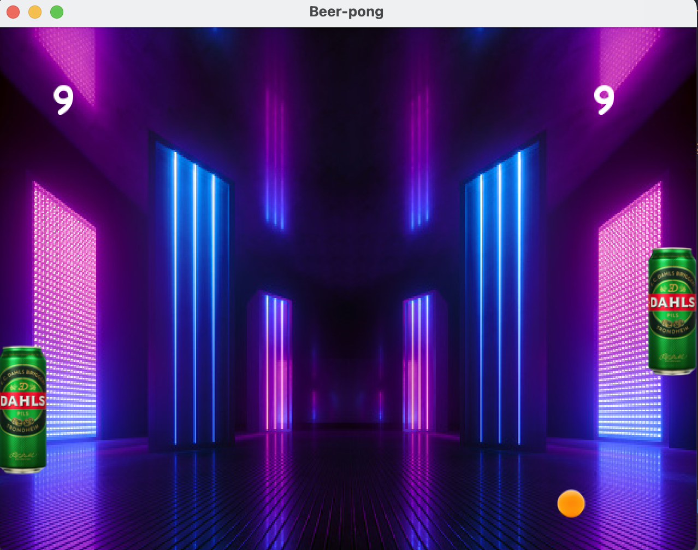

# TDT4240-Exercise-1
First exercise in TDT4140 - Software Architecture.

All tasks are solved using the cross-platform Java game development framework [LibGDX](https://libgdx.com). 

## Task 1
The first task was to draw a helicopter sprite on the screen and make it move around on its own. 
If the sprite is about to leave the screen, it should “bounce” off the edges and head in the opposite direction.

## Task 2
The second task is to draw the same helicopter sprite as in task 1, but now implement a touch function to control the movement. 
The position of the sprite should be displayed in the upper-left corner of the screen. 

## Task 3
The third task was to create the same scenario as in task 1, but now apply animation to the helicopeter sprite. 
In addition, more sprites should be added to the screen. These sprites should move around in random directions with random speed, and bounce off each other on collision. 

## Task 4
The final task was to create a version of the game [Pong](https://www.ponggame.org). Here I created "Beer Pong", with the following game rules: 
- There are two paddles on each side of the screen that can be moved vertically. Both paddles should be controlled by a player. Player 1 uses the **S** and **W** keys to control movement, while player two uses the **up** and **down** arrow keys. 
- The ball starts off in the center of the screen in a random direction, and bounces off the paddles, and the upper and lower edges of the screen.
- If the ball slips past a paddle, the paddle on the opposite side is given one point, and the ball is reset to the middle of the screen. The first player to reach 21 points wins the game.
- The speed of the ball is increased after certain amount of time if no player scores a point. 

